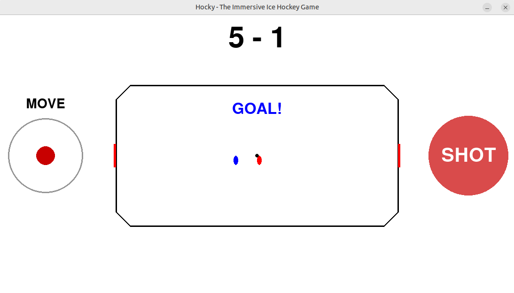

# Hocky
A completely immersive ice hockey game with Python

To all ice hockey fans - from an ice hockey fan :) !

## Requirements
Linux, Python (3), pygame

### Optional:
pygbag (for WebAssembly development)

## License
GPLv3.0

## Acknowledgements:
This project was developed with the assistance of GitHub Copilot (VS code plugin) as well as Google's Gemini, an AI large language model.

## Contact
juhana[at]konekettu.fi
